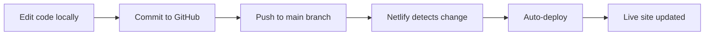

# 🏕️ Boat Lane Paddock – Glamping & Group Retreats

[](https://app.netlify.com/sites/your-site/deploys)

A warm, family-run website for Boat Lane Paddock – a glamping site in the Worcestershire countryside specialising in exclusive group hire for teams, corporates, and wellbeing retreats.

---

## 🚀 Live Site

- **Netlify URL:** `https://boat-lane-paddock.netlify.app`
- **Custom Domain:** `https://boatlaneglamping.co.uk` (coming soon)

---

## 📋 Overview

This website is designed to feel like a personal welcome from the family, not a corporate brochure. It serves as the digital front door for:

- **Group bookings** (20–40+ guests)
- **Corporate & NHS retreats**
- **Wellbeing experiences** (Yoga, Soundfulness, Tea Ceremonies)
- **Family gatherings & special occasions**

### ✨ Key Features

| Feature | Description |
| :--- | :--- |
| **WhatsApp-first booking** | All enquiries go directly to Jonno's WhatsApp – no email setup required |
| **Exclusive hire focus** | Clear messaging around whole-site privacy for groups |
| **Wellbeing experiences** | Dedicated section for Yoga, Soundfulness with Chris Hope, and Tea Ceremonies |
| **Local area guide** | Showcases Boat Lane Brewery, riverside pubs, village shop, and activities |
| **Mobile-friendly** | Fully responsive design for phones and tablets |
| **No online payments** | All bookings handled via WhatsApp/phone – personal touch maintained |

---

## 🛠️ Tech Stack

| Technology | Purpose |
| :--- | :--- |
| **HTML5** | Structure |
| **CSS3** | Styling with animations |
| **Google Fonts** | Inter + Playfair Display |
| **Font Awesome** | Icons |
| **Netlify** | Hosting & deployment |
| **GitHub** | Version control & auto-deploy |

---

## 📁 Project Structure

```
/
├── index.html          # Main website file
├── hero.jpg            # Hero image (night tent shot)
├── paddock.jpg         # Hot tub / paddock shot
├── interior.jpg        # Bell tent interior
├── family.jpg          # Family photo on the river
└── README.md           # This file
```

---

## 🔧 Deployment

This site is deployed via **Netlify** with continuous deployment from GitHub.

### Quick Deploy

1. Fork this repository
2. Connect your GitHub repo to Netlify
3. Set publish directory to `.` (root)
4. Deploy!

### Manual Deploy

1. Copy `index.html` and all images to a folder
2. Drag the folder to [app.netlify.com/drop](https://app.netlify.com/drop)
3. Your site is live in seconds

---

## 📞 Contact Integration

The contact form sends enquiries directly to Jonno's WhatsApp:

```
+44 7530 071 958
```

**How it works:**
1. Visitor fills in the form
2. Clicking submit opens WhatsApp with a pre-filled message
3. Jonno receives the enquiry instantly
4. No email setup required – keeps it personal

---

## 📝 Content Overview

### Pages & Sections

| Section | Content |
| :--- | :--- |
| **Hero** | "Wake to birdsong" headline + CTA buttons |
| **The Paddock** | £99/tent/night, 2 bell tents, hot tub, canoe, bikes |
| **For Teams** | Corporate focus: tailored experiences, privacy, 30-minute rule |
| **Wellbeing** | Yoga, Soundfulness, Tea Ceremony – fees on enquiry |
| **Add-Ons** | Local pubs, brewery, riverside walks, Pétanque, village shop |
| **About** | Jonno & family, Acer the Labrador |
| **Contact** | WhatsApp form + direct call/WhatsApp buttons |

### Brand Voice

- Warm, personal, family-run feel
- Sensory language (birdsong, canvas flap, zip sound)
- Transparent pricing with emphasis on tailored quotes
- Local expertise (Boat Lane Brewery, pubs, walks)

---

## 🖼️ Image Requirements

| Filename | Recommended Content |
| :--- | :--- |
| `hero.jpg` | Wide shot of the paddock at night with tent glowing |
| `paddock.jpg` | Wood-fired hot tub |
| `interior.jpg` | Cosy bell tent interior |
| `family.jpg` | Jonno & family on the river |

Images should be:
- High resolution (min. 1200px wide)
- In JPG format
- Optimised for web (compress before uploading)

---

## 🔄 Auto-Deploy Workflow



---

## 🐛 Troubleshooting

### Images Not Showing?
- Check filenames match exactly: `hero.jpg`, `paddock.jpg`, `interior.jpg`, `family.jpg`
- Ensure they're in the same folder as `index.html`
- Clear your browser cache

### Form Not Opening WhatsApp?
- Check Jonno's number in the `sendWhatsApp()` function: `447530071958`
- Ensure `https://wa.me/` is correctly formatted

### Custom Domain Not Working?
- Verify DNS records: `A` record → `75.2.60.5`
- Wait 24-48 hours for propagation
- Check HTTPS certificate status in Netlify

---

## 📄 License

All content © Boat Lane Paddock – all rights reserved.

---

## 👨‍👩‍👧‍👦 About the Family

Boat Lane Paddock is a family-run glamping site in Worcestershire. Jonno and the family personally handle every booking, ensuring a warm, personal touch for every guest.

---

*Built with ☕ and a bit of help from Claude.*
